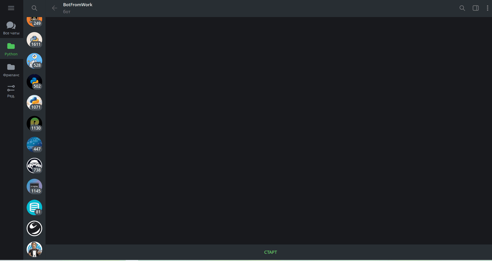
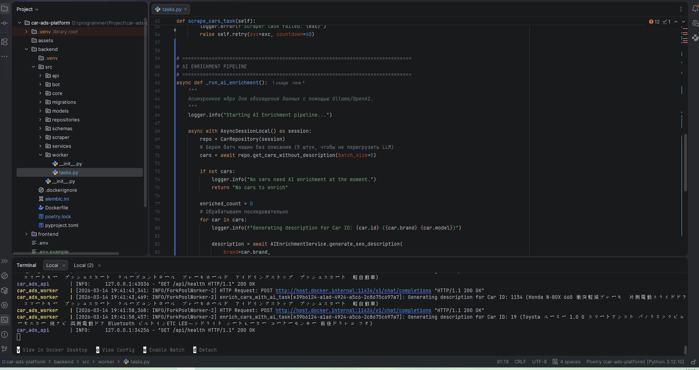

>## 🏎️ Enterprise Car Ads Platform (Async Modular Monolith)

#### Масштабируемая Fullstack-платформа для автоматического сбора, хранения и AI-анализа автомобильных объявлений. Проект построен по принципам Clean Architecture и DDD.

## 🎯 Ключевые возможности (Features)
- **Data Ingestion (Скрапер):** Автономный парсер на базе `httpx` + `BeautifulSoup4`. Защищен от банов по IP паттерном Exponential Backoff (`Tenacity`). Запускается по расписанию через Celery Beat.
- **High-Performance DB:** Bulk Upsert (O(log N)) через `INSERT ... ON CONFLICT DO UPDATE`. Строгая типизация через SQLAlchemy 2.0.
- **Smart Frontend (SPA):** Панель управления на React + Vite. Управление состоянием и кэширование через `TanStack Query`. Настроенные Axios-интерцепторы для бесшовной работы с JWT.
- **AI Telegram Bot:** Интеграция с LLM (OpenAI) через паттерн **Function Calling**. Пользователь пишет запрос естественным языком ("Найди красную мазду до 2 млн"), нейросеть извлекает фильтры, а бот строит безопасный SQL-запрос к базе (защита от Prompt Injection).

## 🛠 Технологический стек
- **Backend:** Python 3.12, FastAPI, SQLAlchemy 2.0, Asyncpg, Alembic, Pydantic V2, PyJWT.
- **Workers:** Celery, Redis.
- **Bot:** Aiogram 3, OpenAI API.
- **Frontend:** React 18, Vite, TanStack Query (React Query), Axios, Material UI / Custom Glassmorphism CSS.
- **DevOps:** Docker, Docker Compose, Multi-stage builds.

## 🚀 Быстрый старт (Zero-Setup)

Проект полностью контейнеризирован. Для запуска нужен только Docker.

### 1. Подготовка
Создайте файлы `.env` в корне проекта (используйте `.env.example` как шаблон).
Убедитесь, что у вас есть ключи для Telegram-бота и OpenAI API.

### 2. Запуск инфраструктуры

> - git clone 
> - cd car-ads-platform
> - cp .env.example .env
> - docker compose up 
> - docker compose exec api alembic upgrade head
> - docker compose exec celery_worker celery -A src.core.celery_app call scrape_cars_task

Система автоматически дождется поднятия БД (healthchecks) и накатит Alembic-миграции.

### 3. Доступ к сервисам

- Frontend Dashboard: http://localhost:3000 (Логин по умолчанию: admin@auto.com / admin123)
- API Swagger Docs: http://localhost:8000/docs
- Telegram Bot: Найдите своего бота в TG и напишите /start

## 🧪 Разработка и Тестирование
> - Для выполнения сервисных команд (миграции, тесты) используется паттерн Toolbox (изолированный контейнер с Poetry):

#### Накатить миграции
- docker compose run --rm toolbox poetry run alembic upgrade head

#### Ручной запуск парсера (не дожидаясь расписания Celery Beat)
- docker compose exec toolbox poetry run python -c "from src.worker.tasks import scrape_cars_task; scrape_cars_task.delay()"

## 🧠 Архитектурные решения (System Design)

1. Single Source of Truth: Единая база кода моделей и БД для API, Бота и Воркеров (Modular Monolith).
2. Connection Pooling Strategy: Разделение стратегий пулинга: QueuePool для FastAPI (быстрые ответы) и NullPool для Celery-воркеров (защита от конфликтов форков и SSL EOF).
3. 12-Factor App: Конфигурация строго через переменные окружения с валидацией Pydantic V2 (BaseSettings).

## 📸 Демонстрация работы (Showcase)

### 1. AI Telegram Бот (Natural Language to SQL)

*
Интеллектуальный поиск и фильтрация через OpenAI Function Calling
*

### 2. React SPA Dashboard & JWT Auth

*
Мгновенный рендеринг и кэширование данных благодаря TanStack Query
*

### 3. Автономный Scraper Engine (Celery Worker)

*
Асинхронный пайплайн: httpx -> Celery -> O(log N) Bulk Upsert (ON CONFLICT DO UPDATE)
*